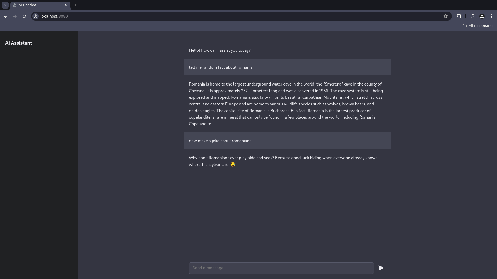

# AI Chatbot

This project is an AI chatbot built using Go, the Gin web framework, and HTMX for the frontend. It leverages powerful language models from Hugging Face and Mistral AI to provide intelligent responses.



## Technologies Used

- **Backend:**
  - Go programming language
  - Gin web framework

- **Frontend:**
  - HTML
  - CSS
  - HTMX for dynamic content updates

- **AI Models:**
  - Hugging Face models
  - Mistral AI models

## Acknowledgements

This project wouldn't be possible without the incredible work of the following organizations:

- [Hugging Face](https://huggingface.co/): For providing access to state-of-the-art machine learning models and a comprehensive ecosystem for natural language processing.
- [Mistral AI](https://mistral.ai/): For their cutting-edge language models that power the intelligent responses in this chatbot.

## Getting Started

### Prerequisites

- Go 1.16 or later
- Gin web framework
- HTMX

### Installation

1. Clone the repository:
    ```bash
    git clone https://github.com/Florin12er/Go-Chat-App.git 
    cd Go-Chat-App
    ```

2. Install dependencies:
    ```bash
    go mod tidy
    ```

3. Create a `.env` file in the root directory of the project and add the following environment variables:
    ```
    PORT=8080
    MODELURL=your_model_url
    HUGGINGFACE_API_KEY=your_huggingface_api_key
    ```
    Replace `your_model_url` and `your_huggingface_api_key` with your actual Hugging Face model URL and API key.

4. Run the application:
    ```bash
    go run main.go
    ```

   The application will start and listen on the port specified in your `.env` file (default is 8080).

## Usage

To use the chatbot:
1. Ensure the application is running.
2. Open your web browser and navigate to `http://localhost:8080` (or whatever port you specified in the `.env` file).
3. Start chatting with the AI in the provided interface.

## License

This project is licensed under the MIT License. See the [LICENSE](LICENSE) file for details.

## Contributing

Contributions to this project are welcome! Please follow these steps:
1. Fork the repository
2. Create a new branch for your feature
3. Commit your changes
4. Push to the branch
5. Create a new Pull Request

## Contact

If you have any questions or feedback, please open an issue on this repository, or mail here : [sebastianflorin603@gmail.com].

